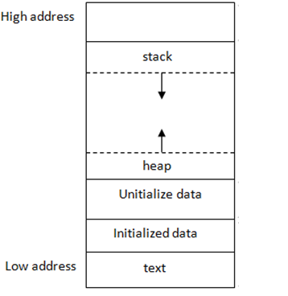
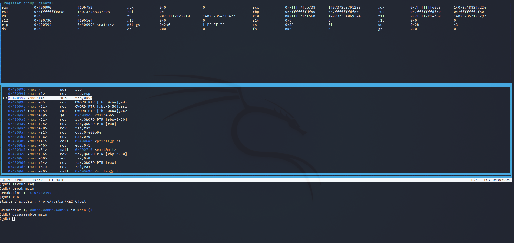

# Lesson 5 - Intro to Reverse Engineering
## What is Reverse Engineering?
Computers only know how to deal with 1s and 0s, and that's really hard for us. When we write programs, we could do it in 1s and 0s, but that's painful and inefficieint. Instead, we write it in programming languages that look more familiar to us, and we have programs called "compilers" that turn that into the 1s and 0s you see for the computer to run. Once you've written a program in C or C++, you've got to compile them and run it. The compiled version of the code is called a binary. However, what if you have the binary and want to convert it back into code?? This is what reverse engineering is. 

## Memory Model
All programs are executed in memory, but how are they stored? The better you understand that, the better you'll be able to reverse engineer binaries. Below is the memory model:



We're just going to focus on the stack. Now, it may seem counterintuitive, but the stack actually goes from the top to the bottom. There are two registers used to keep track of this - the base pointer and the stack pointer. Each time a function is called by another function, another segment is added to the stack. The top of that segment is the base pointer, and the bottom is the stack pointer. In between is where all the variables are initialized, or in other words space is allocated for them at the beginning of the function based on their type.

## Reverse.cpp
Here is the output for running gdb on the most basic function - just returning 0. 
```
user@computer$ gdb -q ./reverse
Reading symbols from ./reverse...
(gdb) list
1       int main(int argc, char* argv[]) {
2           return 0;
3       }
(gdb) disassemble main
Dump of assembler code for function main(int, char**):
   0x0000000000001125 <+0>:     push   rbp
   0x0000000000001126 <+1>:     mov    rbp,rsp
   0x0000000000001129 <+4>:     mov    DWORD PTR [rbp-0x4],edi
   0x000000000000112c <+7>:     mov    QWORD PTR [rbp-0x10],rsi
   0x0000000000001130 <+11>:    mov    eax,0x0
   0x0000000000001135 <+16>:    pop    rbp
   0x0000000000001136 <+17>:    ret    
End of assembler dump.
(gdb) break main
Breakpoint 1 at 0x1130: file reverse.cpp, line 2.
```

### Function Prologue
The only line of code in main is `return 0;` , so you would think that would be the first line in assembly. However, you'll notice that lines 0x1125 to 0x112c have a bunch of random stuff. The compiler adds in a few lines of code to set up the memory for the rest of the functions. These lines are known as the **function prologue**. If you put a breakpoint at the beginning of main, gdb puts it at 0x1130 because it knows that line 2 of code actually starts at memory address 0x1130 (it skips the function prologue). 

#### Function Arguments
At addresses 0x1129 and 0x112c, there are two `mov` commands that involve the edi and rsi registers. In our main function, there are two incoming parameters - an integer (that keeps count of the number of arguments), and a character array (with the arguments). The edi/rdi register is the first parameter passed to a function, and the esi/rsi function has the second parameter. 

Before the main function was called, the argc and argv parameters were put into the edi and rsi registers (respectively). Then, the main function was called. However, since it's possible that the program will need to use the edi and rsi registers later, it needs to store the two arguments locally. 

Addresses 0x1129 and 0x112c store the function arguments locally. This means that if I declare main with **no** arguments, then these two lines wouldn't be here. Address 0x1129 allocates memory for the integer function argument (which we call argc). Where at? Well, the value inside the brackets `[]` indicate where. This integer is stored at `[rbp-0x4]`, or at 4 bytes away from where the rbp register (base pointer) points to. 

So address 0x1129 can be broken up as follows:

```
DWORD PTR [rbp-0x4],edi
    ^         ^      ^ 
I want   | at this | and put 
this much| location| this value
space    |         | in it
```

#### Pushing/Popping the rbp Register
Also note that address 0x1135 pops the rbp register off the stack - this is simply finalizing the function, as it was pushed onto the stack at address 0x1125 in the function prologue.

### Returning Values
Line 2 of code (`return 0;`) correlates with address 0x1130 in the disassemble. The eax/rax register is used to return values from functions. Since we're returning 0, address 0x1130 moves 0 into the eax register, then calls return at address 0x1136. 

Why are we putting 0 into the eax register (32-bit), and not the rax register (64-bit)? We defined the return type for main to be an integer on line 1. Therefore, it doesn't need the rax register, only the shorter eax version. 

## RE2_64bit
This is a binary without the original `.cpp` or `.c` file. Normally, the first step would be to use Ghidra to automatically reverse some components and give you back some janky C code, but we're going to skip that part (another lesson). We will simply cover how to use GDB to do some dynamic analysis on this.

If you run it with GDB, followed by the `layout asm`, `layout reg`, `break main`, and `run`, you will see something like this:



If you want to progress through each line of assembly code, use the `ni` instruction. It will execute the highlighted line, and stop before the next one. If it's calling a function (like `printf`, `exit`, `strlen`, or a custom function) and you use `ni`, then it will run the entire function and go to the next line. If you would like to go *inside* that function to see what it does while running, use the `si` command, then more `ni` commands. Once it's finished, it will return back to your original function and you can continue with `ni`, or `continue` to finish until the next breakpoint/end of the program. 

In more complicated files, you'll want to call a function with your own parameters to see what it does. You can use the `call` command to do so. While using Ghidra, I found a function called `getflagbytid(int tid)` that is never called anywhere. It's just a function laying around, never used. However, based on the name, we know that this is what we want to use. In the CTF problem, they gave me a unique tid, just a 4-digit number. All I need to do is run `call (int) getflagbytid(1234)`, and GDB will run that function with that parameter, and spit out a flag for me! Try it out yourself!!

*Note - sometimes, you'll have to cast the output of the function for it to work. For example, if you simply run `call getflagbytid(1234)`, it will complain to you about an unknown return type. Casting this to an integer will resolve the problem, and allow it to run. Tbh I don't really understand why that is.*

## Additional Resources
* Unrestricted input in binaries can allow you to overwrite values on the stack and insert malicious code - this is called **binary exploitation**, or **pwn**. Micheal has an excellent presentation on the most simple pwn example (which is still difficult) in this repo called "presentation.pdf". 
* If you're really into low-level stuff like this and want to do more reverse engineering/pwn, Ian stumbled upon a great resource called [Nightmare](https://guyinatuxedo.github.io/) (aptly named!). This contains a series of guides and challenges that explains the processes and techniques of reverse engineering. 
* If you'd like to start using Ghidra to allow you to do dynamic and static analysis at the same time, [this tutorial](https://www.shogunlab.com/blog/2019/04/12/here-be-dragons-ghidra-0.html) is a great resource!! Ghidra is super important.
